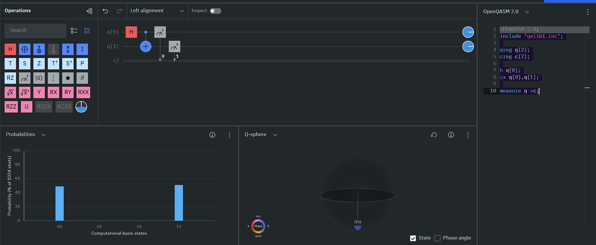

## Section 1

#### 1. |ψ1⟩ = 1/√2(|00⟩ + |11⟩)
```c
OPENQASM 2.0;
include "qelib1.inc";

qreg q[2];
creg c[2];

h q[0];
cx q[0],q[1];

measure q->c;
```



#### 2. |ψ2⟩ = 1/√2(|00⟩ − |11⟩)
```c
OPENQASM 2.0;
include "qelib1.inc";

qreg q[2];
creg c[2];

h q[0];
cx q[0],q[1];
z q[1];

measure q->c;
```


#### 3. |ψ3⟩ = 1/√2(|01⟩ + |10⟩)
```c
OPENQASM 2.0;
include "qelib1.inc";

qreg q[2];
creg c[2];

h q[0];
cx q[0],q[1];
x q[0];

measure q->c;
```


#### 4. |ψ4⟩ = 1/√2(|01⟩ − |10⟩)
```c
OPENQASM 2.0;
include "qelib1.inc";

qreg q[2];
creg c[2];

h q[0];
x q[1];
cx q[0],q[1];
z q[0];

measure q->c;
```


#### 5. |ψ5⟩ = 1/√2(|000⟩ + |111⟩)
```c
OPENQASM 2.0;
include "qelib1.inc";

qreg q[3];
creg c[3];

h q[0];
cx q[0],q[1];
cx q[1],q[2];

measure q->c;
```


#### 6. 1/√2(|000⟩ − |111⟩)
```c
OPENQASM 2.0;
include "qelib1.inc";

qreg q[3];
creg c[3];

h q[0];
cx q[0],q[1];
cx q[1],q[2];
z q[0];

measure q->c;
```

### Section 2

#### Toffoli Gate Note: CCNOT(Toffoli Gate) is a third qubit gate with two controlled qubits. If both controlled qubits are 1 then the target qubit will be flipped. Write down a QASM program where you need to design a four qubits-controlled gate with three qubits acting as control qubits. If all three controlled qubits are equal to one, flip the target qubit. Hint: Use Two Taffoli gates and additional qubits if required

```c
OPENQASM 2.0;
// QASM 2.0 program for a 4-qubit-controlled gate using two Toffoli gates;
include "qelib1.inc";
qreg q[5]; // 3 control bits, one auxillary and one target bit
creg c[1]; // to store result of measurement
// Initialize control qubits to 1 as CCNOT gate //only flips when all control bits are 1
x q[0];
x q[1];
× q[2];
// First Toffoli gate - Uses q[0] and q[1] as controls, //stores the result in auxiliary q[3],
//not q[2] as it will be used as a control bit later
ccx q[0], q[1], q[3];
// Second Toffoli gate - Uses q[3] and q[2] as controls, flips the target q[4] ccx q[3], q[2], q[4];
measure q[4] -> c[0];
```


### Section 3
#### Toffoli Gate is a Universal Gate. Write QASM program to perform the followings:
  
1. Toffoli gate act as AND Gate.

```c
// Toffoli AND Gate OPENQASM 2.0;
include "qelib1.inc";
qreg q[3];
creg c[1];
// Test inputs
x q[0];
x q[1];
// q[0] = A, q[1] = B, q[2] = Output // Classical register to store the result
// Set A = |1> (e.g., input A = 1)
// Set B = |1> (e.g., input B = 1)
// Compute AND(A, B) and store in q[2]
ccx q[0], q[1], q[2]; // q[2] = A AND B = 1
// Measure the result measure q[2] -> c[0];
```


2. Toffoli gate act as NOT Gate. 
```c

// Toffoli NOT Gate OPENQASM 2.0;
include "qelib1.inc";
qreg q[3];
creg c[1];
// q[0] = A, q[1] = B, q[2] = Output // Classical register to store the result
// Set control Qubits to 1
x q[0];
x q[1];
// Set A = |1>
// Set B = |1>
// Take Target Qubit as 0 or 1, taking 1 here x q[2];
// Apply NOT to q[2] (flips only if controls are |1>) ccx q[0], q[1], q[2]; // q[2] = NOT (1) = 0
// Measure the result 
measure  q[2] -> c[0];
```


### Section 4
#### Write down a QASM Program to create half adder. Hint: Make use of CCNOT and CNOT

```c
// Toffoli Half Adder
// A half adder will add 2 bits, which is done using a XOR Gate
// When two bits are added there can be a carry
// A XOR gate gives 0 when both inputs are same
// A CNOT Gate flips bit when control bit is 1, 
// CCNOT flips when both control bits are 1
// Therefore a CNOT Gate acts as a XOR Gate 
// as x=|0> y=|0> leaves y as 0, 
// while x=|1> and y=|1> changes y to 0,, thus same input gives 0
OPENQASM 2.0;
include "qelib1.inc";
qreg q[3]; // 2 inputs, one sum
qreg carry[1]; // To compute possible carry bit
creg c[2]; // Measure Sum, carry

x q[0];
x q[1];
// q[2] initialised as 0 by default to store the sum
// Using these 2  bits as inputs, they act as control bits for q2
// Input/Control bit 1 XOR target bit
cx q[0],q[2]; // 1+0=1
// Input/Control bit 2 XOR target bit
cx q[1],q[2]; // 1+1=10

// Now the carry bit is computed as (old carry) XOR (q0.q1)
// Since initial carry bit is 0, we do AND of q1 and q2
// Using Toffoli(CCNOT) gate as our AND Gate
ccx q[0],q[1],carry[0];

// Measure Everything
measure q[2] -> c[0]; // Sum
measure carry[0] -> c[1]; // Carry
// Final Results:
// 1+1=10
```
