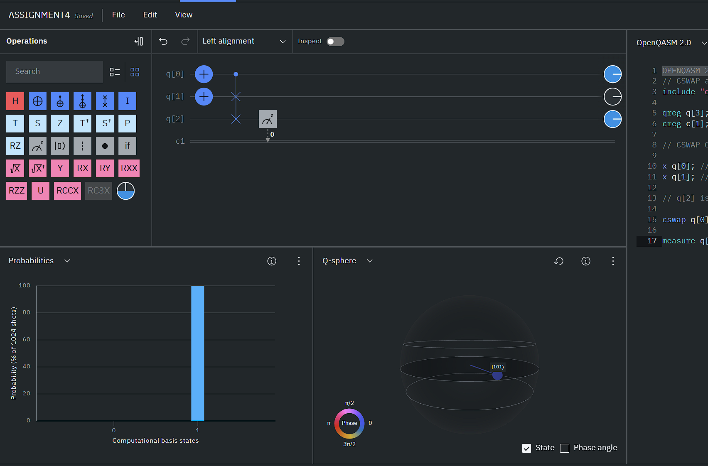
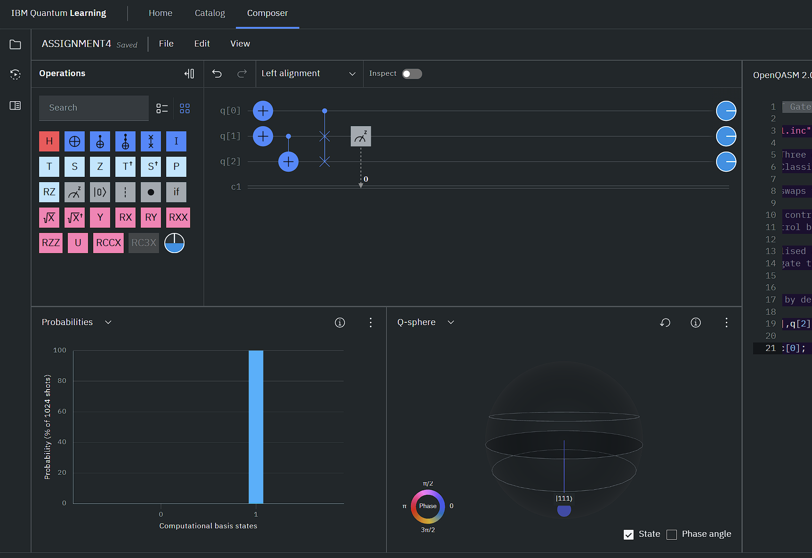
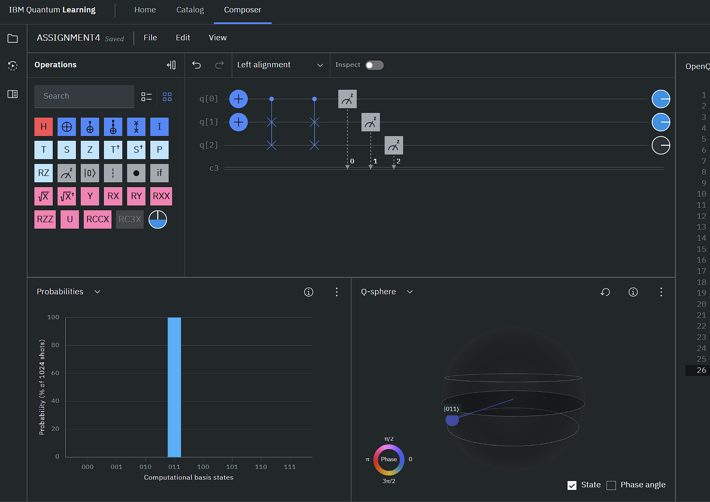
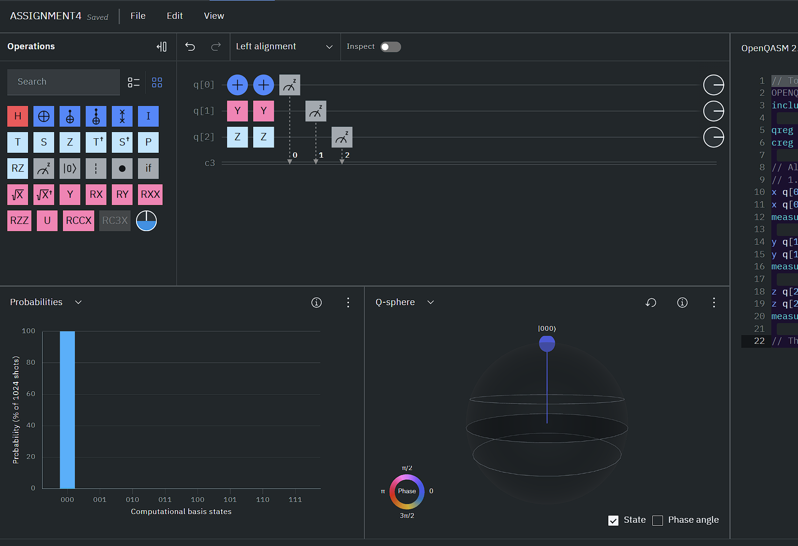
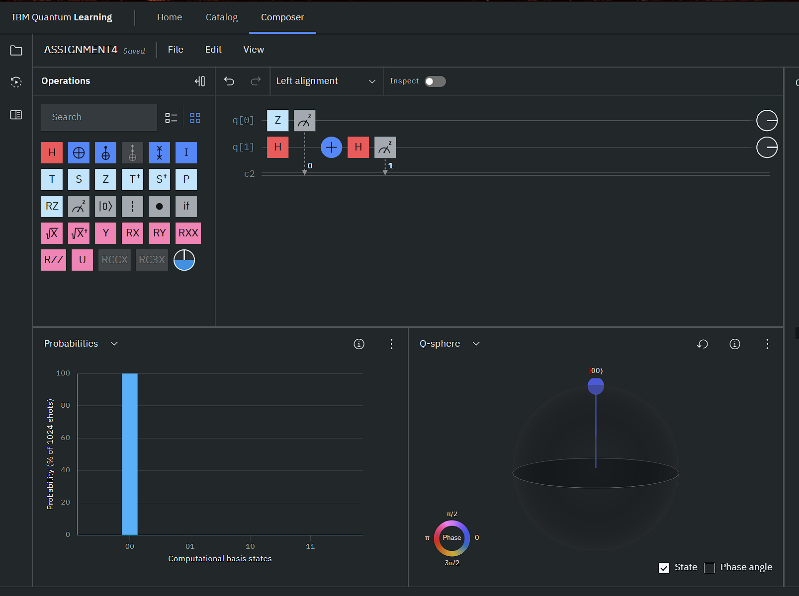
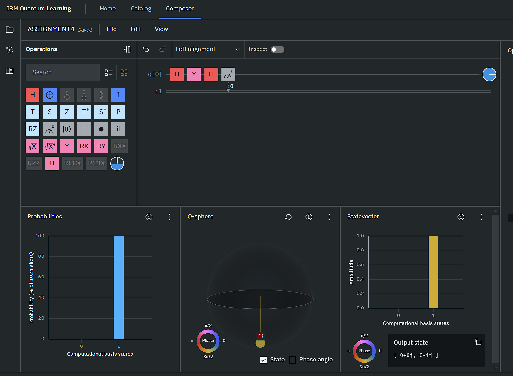

## Section 1

#### Write down a QASM Program to show that Fredkin gate act as AND Gate (Do not use the Drag and Drop option).

```c
OPENQASM 2.0;
// CSWAP as AND Gate
include "qelib1.inc";

qreg q[3]; // Three qubits: q[0] (control), q[1] (A), q[2] (B)
creg c[1]; // Classical register to store the AND output

// CSWAP Gate swaps two bits when control qubit is |1> 

x q[0]; //set control bit as |1>
x q[1]; // set input as |1>

// q[2] is |0> by default

cswap q[0],q[1],q[2]; // control quibit as q[0], this effectively does q[0] AND q[1]

measure q[2]->c[0]; // swapped q[1] and q[2], q[2]=|1>, which is q[0] AND q[1] wrt how they were initialised.
```



## Section 2

#### Write down a QASM Program to show that Fredkin gate act as NOT Gate (Do not use the Drag and Drop option).

```c
// CSWAP as NOT Gate
OPENQASM 2.0;
include "qelib1.inc";

qreg q[3]; // Three qubits: q[0] (control), q[1] (control for cnot), q[2] (target)
creg c[1]; // Classical register to store the NOT output.

// CSWAP Gate swaps two bits when control qubit is |1>. 

x q[0]; // set control bit as |1>.
x q[1]; // control bit for cnot gate set as |1>.
//x q[2];
// q[2] initialised as |0> but NOT works when it is |1> too. 
// use a cnot gate to ensure that one qubit as opposite of the other.
cx q[1],q[2];

// q[2] is |0> by default

cswap q[0],q[1],q[2]; // control quibit as q[0], this effectively swaps the two opposite bits

measure q[1]->c[0]; // swapped q[1] and q[2], q[1]=|1>, which is NOT q[2] which was |0>.
```



## Section 3

#### Section 1 and Section 2 indicate that CSWAP is a universal gate. Now Write down a QASM Program to verify that CSWAP has its own inverse.

```c
// CSWAP being its own Inverse
OPENQASM 2.0;
include "qelib1.inc";

// Being its own inverse means giving the same state of the qubit as was initially provided, when the gate is applied twice on the same qubit
qreg q[3]; // Three qubits: q[0] (control), q[1] (first target), q[2] (second target)
creg c[3]; // Classical register to store the results.

// CSWAP Gate swaps two bits when control qubit is |1>. 

x q[0]; // set control bit as |1>.
x q[1]; // first target bit set as |1>.
//x q[2];
// q[2] initialised as |0>. 

//so q[0]=|1>, q[1]=|1> and q[2]=|0>

cswap q[0],q[1],q[2]; // control quibit as q[0], this effectively swaps the two opposite bits
cswap q[0],q[1],q[2]; // control quibit as q[0], this effectively swaps the two opposite bits

measure q[0]->c[0]; 
measure q[1]->c[1]; 
measure q[2]->c[2];

// Output as 011, i.e., q[2]q[1]q[0]
// We get the same values for the bits as we initialised. Thus verified.
```



## Section 4

#### Verify the Identities using QASM:

#### X^2 = Y^2 = Z^2 = I

```c
// To verify X^2=Y^2=Z^2=I
OPENQASM 2.0;
include "qelib1.inc";

qreg q[3];     // 3 qubits for testing different identities
creg c[3];     // 3 classical registers for measurement

// All qubits initialised as |0>
// 1. Verify X^2 = I, Y^2 = I, Z^2 = I
x q[0];    // Apply X
x q[0];    // Apply X again (X^2)
measure q[0] -> c[0]; // Returns 0 which is |0> X I

y q[1];    // Apply Y
y q[1];    // Apply Y again (Y^2)
measure q[1] -> c[1]; // Returns which is |0> X I

z q[2];    // Apply Z
z q[2];    // Apply Z again (Z^2)
measure q[2] -> c[2]; // Returns which is |0> X I

// Therefore X^2=Y^2=Z^2=I
```



#### X = HZH

```c
// To verify X = HZH
OPENQASM 2.0;
include "qelib1.inc";

qreg q[2];     // 2 qubits for testing different identities
creg c[2];     // 2 classical registers for measurement

// All qubits initialised as |0>
// 2. Verify X = HZH
x q[0];    // Apply X gate on q[0] = |0> which gives |1>
measure q[0] -> c[0];

h q[1]; // Apply H gate on q[1] = |0>
z q[1]; // Apply Z gate on H(q[0)]
h q[1]; // Apply H gate on HZ(q[0])
measure q[1] -> c[1];

// We get the same results for q[0] and q[1]. thus verified.
```


#### Z = HXH

```c
// To verify Z = HXH
OPENQASM 2.0;
include "qelib1.inc";

qreg q[2];     // 2 qubits for testing different identities
creg c[2];     // 2 classical registers for measurement

// All qubits initialised as |0>
// 3. Verify Z = HXH
z q[0];    // Apply Z gate on q[0] = |0> which gives |0>
measure q[0] -> c[0];

h q[1]; // Apply H gate on q[1] = |0>
x q[1]; // Apply X gate on H(q[0)]
h q[1]; // Apply H gate on HX(q[0])
measure q[1] -> c[1];

// We get the same results for q[0] and q[1]. thus verified.
```



#### S = T^2
```c
// To verify S = T^2
OPENQASM 2.0;
include "qelib1.inc";

qreg q[2];     // 2 qubits for testing different identities
creg c[2];     // 2 classical registers for measurement

// All qubits initialised as |0>
// 4. Verify S = T^2
s q[0];    // Apply S gate on q[0] = |0> which gives |0>
measure q[0] -> c[0];

t q[1]; // Apply T gate on q[1] = |0>
t q[1]; // Apply T gate on T(q[0)] to get T^2
measure q[1] -> c[1];

// We get the same results for q[0] and q[1]. thus verified.
```


#### −1Y = XY X

##### For -Y
```c
OPENQASM 2.0;
include "qelib1.inc";

qreg q[1]; 
creg c[1];

// Prepare |+> state to give an observable magnitude
h q[0];

// Apply Y
y q[0];

// Apply Hadamard to check phase interference
h q[0];

// Measure
measure q[0] -> c[0];

// Output state is [0+0j, 0-1j], for -Y it will be [0+0j, 0+1j]
```



##### For XYX

```c
OPENQASM 2.0;
include "qelib1.inc";

qreg q[1]; 
creg c[1];

// Prepare |+> state for an observable magnitude
h q[0];

// Apply XYX
x q[0];
y q[0];
x q[0];

// Apply Hadamard to check phase interference
h q[0];

// Measure
measure q[0] -> c[0];

// Result is [0+0j, 0+1j] which is same as -Y.
```


