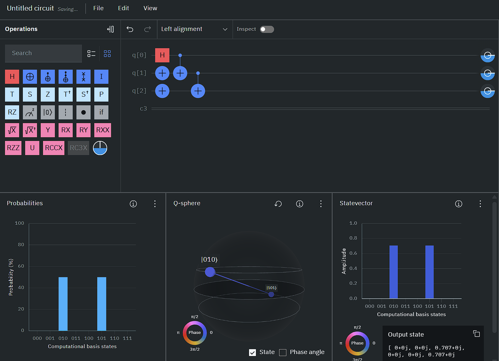
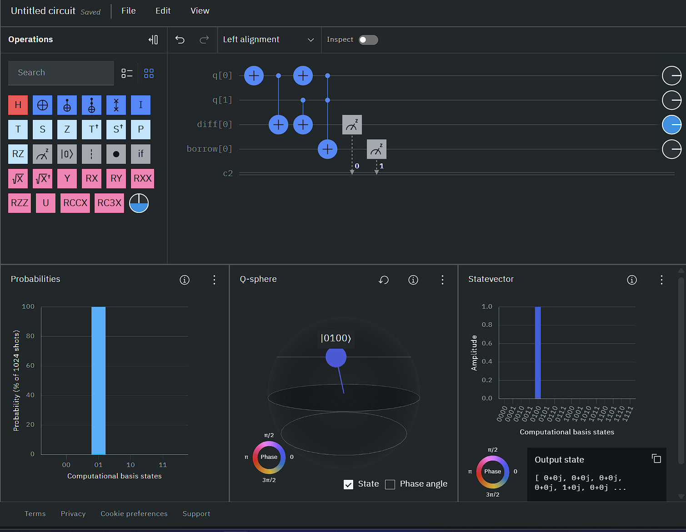

### Q1

#### Make a circuit for 1/√2(|010⟩ + |101⟩)

```c
OPENQASM 2.0;
include "qelib1.inc";

qreg q[3];
creg c[3];

h q[0];
x q[1];
x q[2];
cx q[0], q[1];
cx q[1], q[2];

measure q -> c;
```



### Q2

#### Make a binary half subtractor

```c
OPENQASM 2.0;
include "qelib1.inc";

qreg q[2];
qreg diff[1];
qreg borrow[1];
creg c[2];

// q[0] -> A
// q[1] -> B
// diff -> Store the difference A-B which is A XOR B
// borrow -> Store the borrow bit which is A' AND B, i.e., (NOT A) AND B

x q[0];
//x q[1];

cx q[0],diff[0]; // Partial XOR
cx q[1],diff[0]; // Full XOR

x q[0]; // NOT A

ccx q[0],q[1],borrow[0]; // (NOT A) AND B stored in borrow
measure diff[0] -> c[0];
measure borrow[0] -> c[1];
```




### NOTE: Remember that by default indexing is done from right to left so if u want to make |011> starting with q[0], you'll end up making |110> by default so use measure wrt position properly

### EXTRAS

#### Make a circuit for 1/√2(|010⟩ - |101⟩)

```c
OPENQASM 2.0;
include "qelib1.inc";

qreg q[3];
creg c[3];
// or start with x q[0];
h q[0];
x q[1];
x q[2];
cx q[0], q[1];
cx q[1], q[2];
z q[0]; // or z q[2]

measure q -> c;
```

#### Make a circuit for 1/√2(|100⟩ - |011⟩)

```c
OPENQASM 2.0;
include "qelib1.inc";

qreg q[3];
creg c[3];

x q[1];
x q[2];
h q[0]; //011 + 111
cx q[0], q[1]; //011 + 101
cx q[0], q[2]; //011 + 100
z q[2]; //-011 + 100

measure q[0] -> c[2];
measure q[1] -> c[1];
measure q[2] -> c[0];
// this kind of measuring simply shows the qubits in the way we wanted
```

#### Make a circuit for 1/√2(|110⟩ - |011⟩)

```c
OPENQASM 2.0;
include "qelib1.inc";

qreg q[3];
creg c[3];

x q[1];
x q[2];
h q[0]; //011 + 111
cx q[0], q[2]; //011 + 110
z q[2]; //-011 + 110

measure q[0] -> c[2];
measure q[1] -> c[1];
measure q[2] -> c[0];
```

### More codes, chatgpt made

```c
// Quantum Logic Circuit Implementations in QASM 2.0
OPENQASM 2.0;
include "qelib1.inc";

// ----------------------------------------
// 1. Half Adder
qreg q_ha[3];   // q[0]=A, q[1]=B, q[2]=Sum
creg c_ha[2];   // c[0]=Sum, c[1]=Carry
cx q_ha[0], q_ha[2];
cx q_ha[1], q_ha[2];
ccx q_ha[0], q_ha[1], q_ha[1];
measure q_ha[2] -> c_ha[0];  // Sum = A XOR B
measure q_ha[1] -> c_ha[1];  // Carry = A AND B

// ----------------------------------------
// 2. Full Adder
qreg q_fa[5];   // q[0]=A, q[1]=B, q[2]=Cin, q[3]=Sum, q[4]=Carry
creg c_fa[2];
cx q_fa[0], q_fa[3];
cx q_fa[1], q_fa[3];
cx q_fa[2], q_fa[3];
ccx q_fa[0], q_fa[1], q_fa[4];
ccx q_fa[1], q_fa[2], q_fa[4];
ccx q_fa[0], q_fa[2], q_fa[4];
measure q_fa[3] -> c_fa[0];  // Sum
measure q_fa[4] -> c_fa[1];  // Carry

// ----------------------------------------
// 3. Half Subtractor
qreg q_hs[4];   // q[0]=A, q[1]=B, q[2]=Diff, q[3]=Borrow
creg c_hs[2];
cx q_hs[0], q_hs[2];
cx q_hs[1], q_hs[2];
x q_hs[0];
ccx q_hs[0], q_hs[1], q_hs[3];
x q_hs[0];
measure q_hs[2] -> c_hs[0];
measure q_hs[3] -> c_hs[1];

// ----------------------------------------
// 4. Full Subtractor
qreg q_fs[6];   // q[0]=A, q[1]=B, q[2]=Bin, q[3]=Diff, q[4]=Borrow1, q[5]=Borrow2
creg c_fs[2];
cx q_fs[0], q_fs[3];
cx q_fs[1], q_fs[3];
cx q_fs[2], q_fs[3];
x q_fs[0];
ccx q_fs[0], q_fs[1], q_fs[4];
x q_fs[0];
x q_fs[3];
ccx q_fs[3], q_fs[2], q_fs[5];
x q_fs[3];
measure q_fs[3] -> c_fs[0];  // Diff
measure q_fs[4] -> c_fs[1];  // Combined Borrow (can be OR-ed classically with q_fs[5])

// ----------------------------------------
// 5. 1-bit Multiplier
qreg q_mul[3];  // q[0]=A, q[1]=B, q[2]=Product
creg c_mul[1];
ccx q_mul[0], q_mul[1], q_mul[2];
measure q_mul[2] -> c_mul[0];

// ----------------------------------------
// 6. 1-bit Comparator (A == B)
qreg q_eq[3];   // q[0]=A, q[1]=B, q[2]=Result
creg c_eq[1];
cx q_eq[0], q_eq[2];
cx q_eq[1], q_eq[2];
x q_eq[2];       // XNOR(A, B)
measure q_eq[2] -> c_eq[0];

// ----------------------------------------
// 7. AND Gate
qreg q_and[3];
creg c_and[1];
ccx q_and[0], q_and[1], q_and[2];
measure q_and[2] -> c_and[0];

// ----------------------------------------
// 8. OR Gate
qreg q_or[3];
creg c_or[1];
x q_or[0];
x q_or[1];
ccx q_or[0], q_or[1], q_or[2];
x q_or[2];
measure q_or[2] -> c_or[0];

// ----------------------------------------
// 9. XOR Gate
qreg q_xor[3];
creg c_xor[1];
cx q_xor[0], q_xor[2];
cx q_xor[1], q_xor[2];
measure q_xor[2] -> c_xor[0];

// ----------------------------------------
// 10. NAND Gate
qreg q_nand[3];
creg c_nand[1];
ccx q_nand[0], q_nand[1], q_nand[2];
x q_nand[2];
measure q_nand[2] -> c_nand[0];

// ----------------------------------------
// 11. NOR Gate
qreg q_nor[3];
creg c_nor[1];
x q_nor[0];
x q_nor[1];
ccx q_nor[0], q_nor[1], q_nor[2];
x q_nor[2];
measure q_nor[2] -> c_nor[0];

// ----------------------------------------
// 12. Parity Checker (even parity = 1 if even number of 1s)
qreg q_parity[4];  // q[0], q[1], q[2]=inputs; q[3]=output
creg c_parity[1];
cx q_parity[0], q_parity[3];
cx q_parity[1], q_parity[3];
cx q_parity[2], q_parity[3];
x q_parity[3];  // Output 1 if even parity
measure q_parity[3] -> c_parity[0];
```